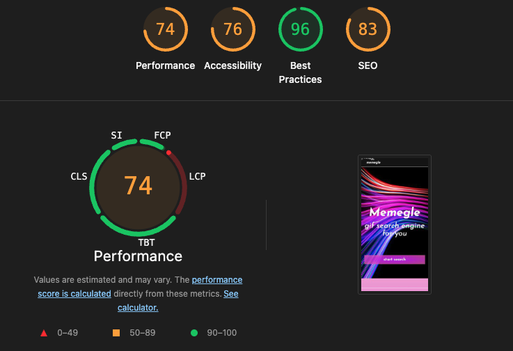
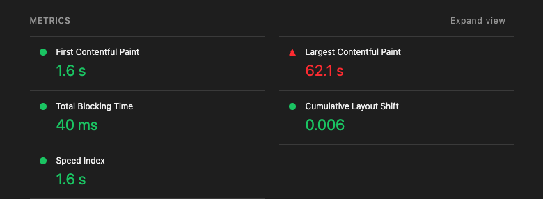

# 깃헙 배포 성능 측정하기 (성능 개선 전)

## 성능 지표 항목

- LightHouse
- Home 페이지에서 불러오는 스크립트 리소스 크기
- 히어로 이미지 크기
- 프랑스 파리에서 Fast 3G 환경으로 접속했을 때 Home 두 번째 이후 로드시 LCP < 1.2s
  WebPageTest에서 Paris - EC2 Chrome CPU 6x slowdown Network Fast 3G 환경 기준으로 확인
- Chrome CPU 6x slowdown Network Fast 3G 환경에서 화면 버벅임 최소화

1. LightHouse





```

1. Performance 74
1.1: First Contentful Paint 1.6 s (최초 콘텐츠가 뜨는 시간)
1.2: Largest Contentful Paint 62.1 s (가장 큰 콘텐츠가 뜨는 시간)
1.3: Total Blocking Time 40ms
1.4: Cumulative Layout Shift 0.006 (화면 버벅임/밀림 현상)
1.5: Speed Index: 1.62

2. Accessibility 76

3. Best Practices 96

4. Seo 83

```
